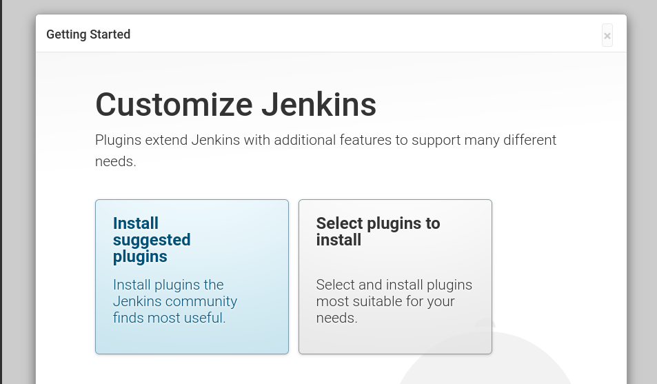

# Instalar Jenkinks

```shell
docker-compose up -d
```

```shell
docker-compose logs -f jenkins

```

```shell
jenkins_1  | *************************************************************
jenkins_1  | *************************************************************
jenkins_1  | *************************************************************
jenkins_1  | 
jenkins_1  | Jenkins initial setup is required. An admin user has been created and a password generated.
jenkins_1  | Please use the following password to proceed to installation:
jenkins_1  | 
jenkins_1  | d3e6bd10a31f40cabda662a93a8e443c
jenkins_1  | 
jenkins_1  | This may also be found at: /var/jenkins_home/secrets/initialAdminPassword
jenkins_1  | 
jenkins_1  | *************************************************************
jenkins_1  | *************************************************************
jenkins_1  | *************************************************************
```

> Encaso de ser necesario se puede acceder al contenedor ejecutando `docker-compose exec jenkins /bin/bash -c 'cat /var/jenkins_home/secrets/initialAdminPassword'`



Seleccionamos instalar los sugeridos.

## TODO

- [ ] Terminar documentación xD